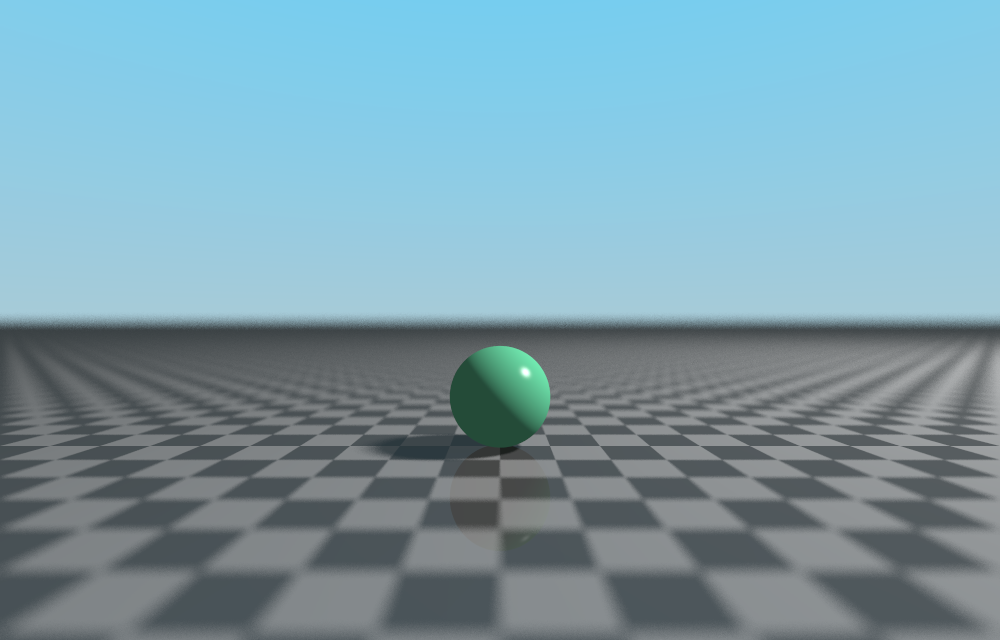
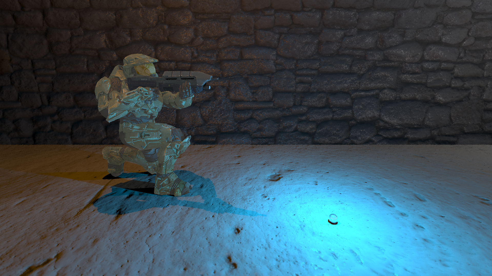
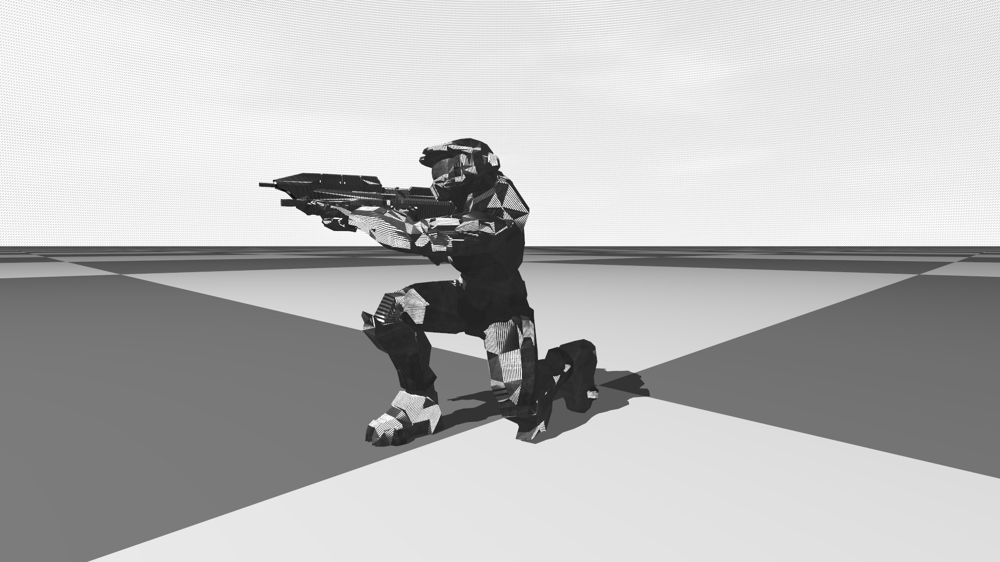

# Raytracer
A simple raytracer made for fun. It is a work in progress.

## How to Build
```
cd Raytracer
cmake -H. -Bbuild
make -j4 -C build
```

## How to Run
```
./raytracer scene.yaml [-threads=8]
```
## Bugs and Limitations
- Specular map should be float texture
- skymaps look like garbage
- Non PBR

## TODO
- clean TODOs and FIXMEs
- energy conserving phong?

## Features
- Multi-threaded
- Plane, Sphere, Triangles, OBJ/MTL files
- BlinnPhong, Reflectivity, and Transparancy 
- Point and directional lights
- Sky spheres
- Textures
- Normal Mapping
- Specular Mapping without gloss
- BVH acceleration for OBJ models
- YAML scene specification
- PNG, JPG, BMP input
- PPM output
- Anti-aliasing via multiple samples
- Soft shadows

## Sample Renders
  
*Cornell box*
  

*Default scene*
 

*Depth of field example*
  

*Glass bunny example*


*Masterchief with texture, specular, and normal maps.*


*Interesting bug*

## CONTRIBUTIONS
Thanks to Cory B. for suggesting non-blocking threading.
