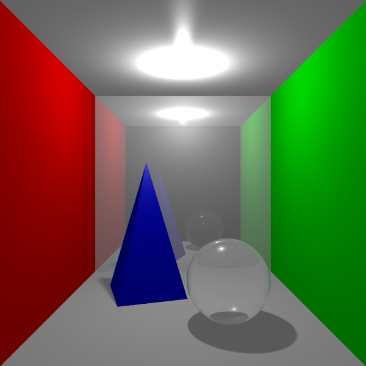
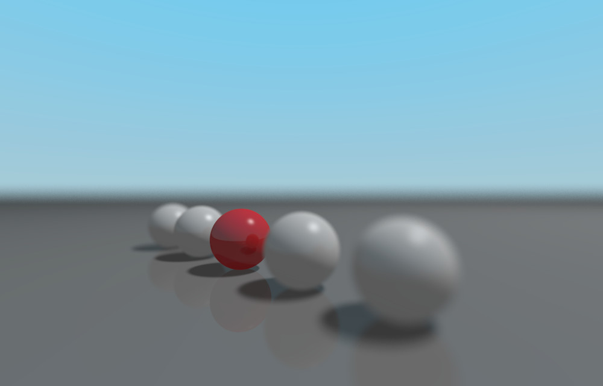
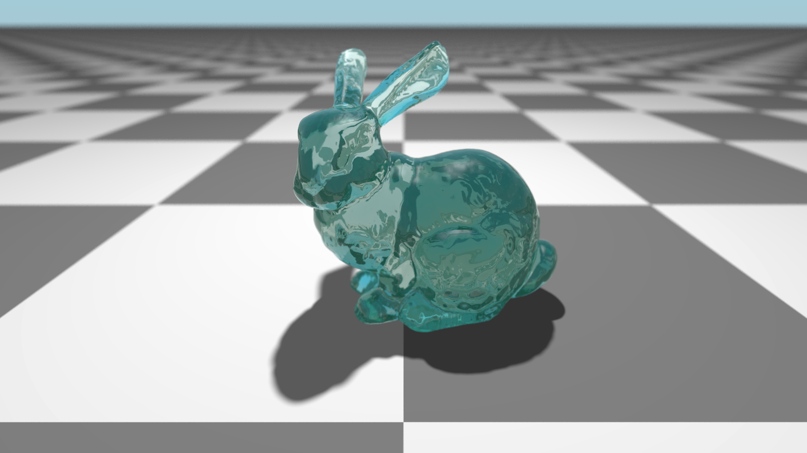

# Raytracer
A simple raytracer made for fun. It is a work in progress.

## How to Build
```
cd Raytracer/build
cmake ..
make
```

## How to Run
```
./raytracer scene.yaml [-threads=8]
```
## Bugs and Limitations
- Non PBR

## TODO
- clean todos and fixmes
- Render a scene with all types of geometry
- make a few interesting scenes showing off features
- energy conserving phong

## Features
- Multi-threaded
- Plane, Sphere, Triangles, OBJ/MTL files
- BlinnPhong, Reflectivity, and Transparancy 
- Point and directional lights
- Sky spheres
- Textures
- Normal Mapping
- BVH acceleration for OBJ models
- YAML scene specification
- PNG, JPG, BMP input
- PPM output
- Anti-aliasing via multiple samples
- Soft shadows

## Sample Renders



